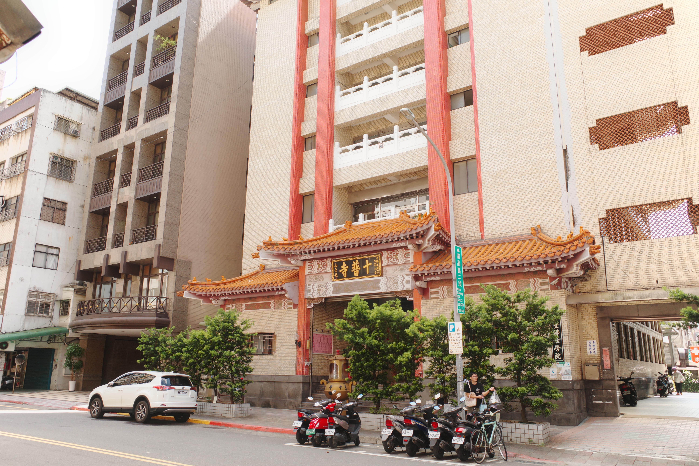

# 醫生你是不是老了 - 拔智齒

*2024年9月20日 · 閱讀時間約 45 秒*

今天去拔智齒，原本以為這次也會像兩個月前那樣輕鬆搞定。當時拔右半邊的智齒，醫生只花了三分鐘，簡直像開罐頭一樣輕鬆。我還心想：「拔智齒也不過如此嘛！」於是這次我完全沒放在心上，覺得應該很快就能結束。

結果，事情發展完全超乎預期。醫生拿起夾子，一拉，我就感覺不對勁。牙齒紋絲不動，醫生額頭都開始冒汗。我想：「欸？該不會這次沒那麼順利吧？」醫生又換了個姿勢，這次還用上了兩隻手，像在拔什麼卡住的老古董。他使勁兒了半天，我還能看到他小臂的肌肉在顫抖。

這一拉拉了十分鐘以上，醫生不耐煩的說：「頭燈不夠亮啦．來個人調整一下」我心裡無語的是：「你是不是老了力氣不夠啊？」但我沒敢說出口，怕他一氣之下再拉不動。就這麼一直拽、一直扯，整個拔牙過程變得荒唐起來，彷彿醫生在跟我的智齒進行力量對決。
